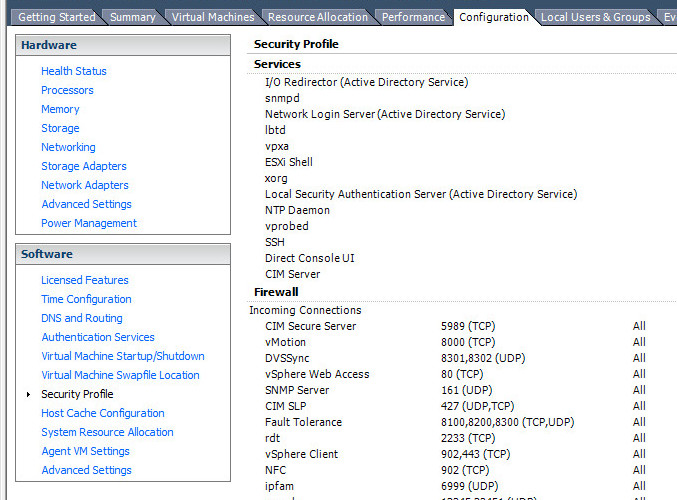
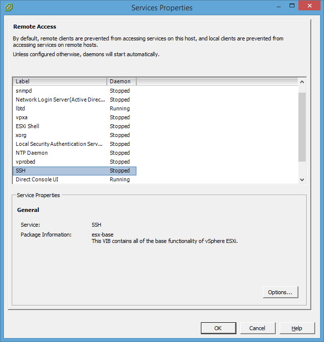
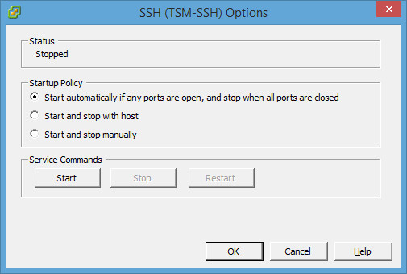

#déplacer une machine virtuel

##Près-requis

Le service ssh doit être activé sur le noeud esxi. Pour ce faire,
ouvrir une connexion avec VSphere client et cliquer sur l'onglet
Configuration.





Sélectionner au dans la rubrique logiciel "profil de sécurité".



   
cliquer sur propriétés dans les service et demarrer le service ssh.



   

##procéder a la migration

Se connecter sur le serveur esx en ssh. Avec la première commande nous
allons obtenir la liste des vm et la deuxième la dé-enregistre.
Attention la vm doit-être stopper.

``` 
  ~ # vim-cmd vmsvc/getallvms
  ~ # vim-cmd vmsvc/unregister [Vmid]
```

Déplacer le répertoire contenant toute la VM dans le store que vous
voulez.

```
  ~ # mv /vmfs/volumes/DATA1/VM_1 /vmfs/volumes/DATA2/VM_1

```

Après avoir effectué le déplacement vous pouvez enregistrer la vm
déplacer. Attention toujours bien donner la totalité du chemin de
la VM.

```
  ~ # vim-cmd solo/registervm /vmfs/volumes/DATA2/VM_1/vm_1.vmx
```
Lors du premier démarrage informer que c'était un déplacement et nom
une copy.


